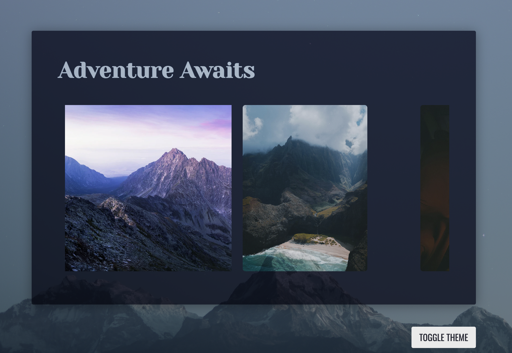
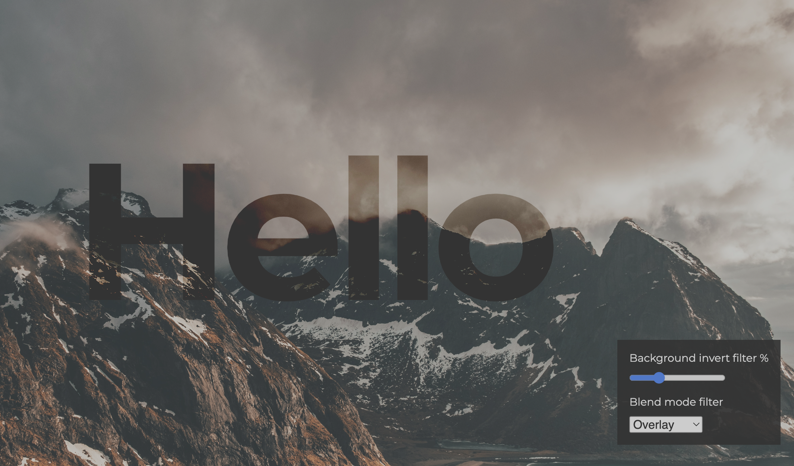
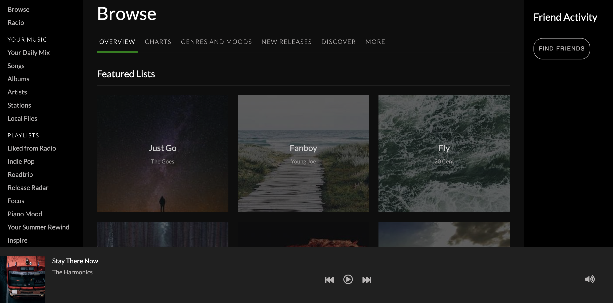

<!-- Profile README for sheelah -->

<h1 align="center" style="color:#6C63FF;">
  Hi, I'm Sheelah 👋
</h1>

  
  
  

---

### 👩‍💻 About Me

I love building <strong>polished, accessible user experiences for the web</strong>. While my specialty is <b>frontend development</b>, I have full-stack knowledge—plus a solid foundation in <b>site reliability engineering</b>.

I deeply care about both design and web performance, and enjoy experimenting with new techniques in CSS and JavaScript.

---

### 🛠️ Top Skills

- **Languages:** TypeScript, JavaScript, CSS
- **Frameworks:** React
- **Testing:** Software testing best practices
- **AI Tools:** Cursor, GitHub Copilot

---

### 🚀 Featured Projects

Here are some of my favorite CodePen demos & experiments:

See more at my [CodePen profile](https://codepen.io/sheelah)!

---

### 🔗 Find Me Online

- 📝 [Blog](https://sheelahb.com)
- 💡 [CodePen](https://codepen.io/sheelah)
- 🦋 [BlueSky](https://bsky.app/profile/sheelah.bsky.social)
- 💼 [LinkedIn](https://www.linkedin.com/in/sheelah)

---

### 🎨 Preferred Theme

I gravitate toward darker tones of blue, purple, and gray—think sleek, modern, and easy on the eyes.

---

  
  

<!--
Want to collaborate, chat about frontend, or swap CSS tricks? Reach out!
-->
